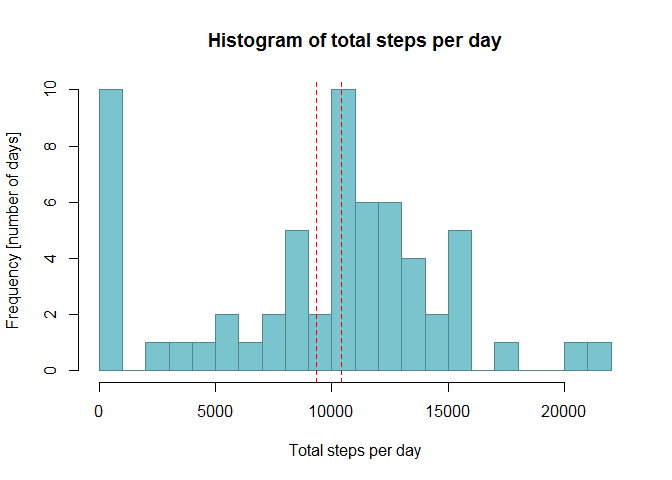
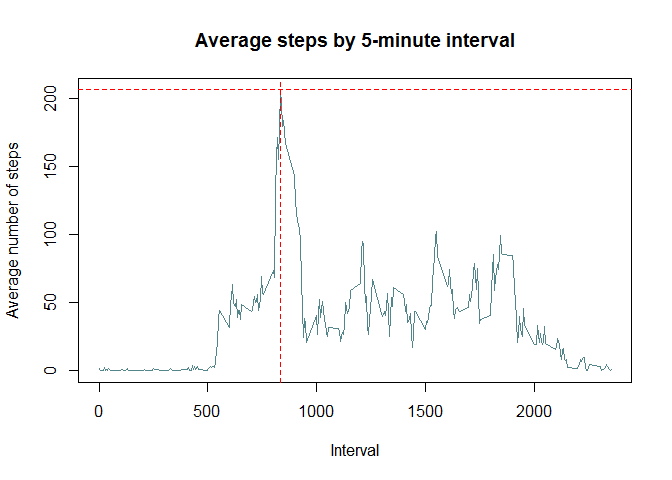
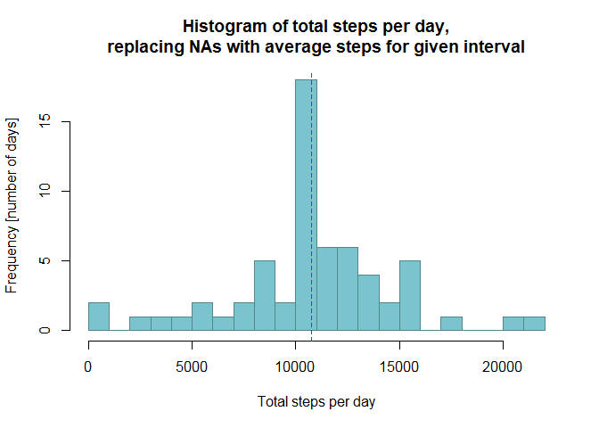
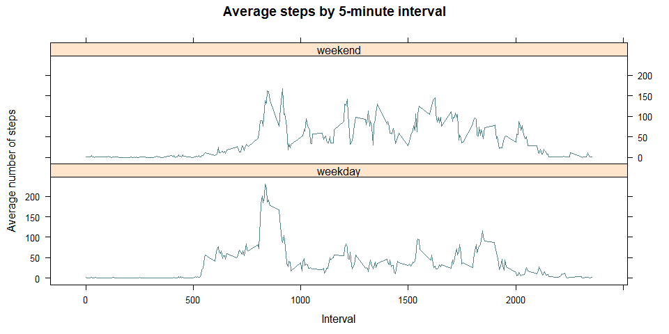

Reproducible Research - Course Project 1
========================================

This document analyzes an activity dataset containing number of steps
recorded in 5-minute intervals across various days.

It was generated using [Knitr](https://github.com/yihui/knitr)

    install.packages('knitr', dependencies = TRUE)
    library(knitr)
    knit("PA1_template.md", force_v1 = TRUE)

It also includes some sample data output to verify results.

Loading and preprocessing the data
----------------------------------

The following code loads the data into a variable `activity`. The script
will attempt to download and unzip the file if it doesn’t exist inside
the work directory.

    #we check if the source file is loaded onto the wd of the reader, if not, we download it and unzip the file:
    if(!file.exists("activity.csv")) {
           tempfile <- tempfile()
            download.file("http://d396qusza40orc.cloudfront.net/repdata%2Fdata%2Factivity.zip",destfile = tempfile)
            unzip(tempfile)
            unlink(tempfile)
    }

    activity <- read.csv("activity.csv", header = TRUE)
    # To prevent scientific notation
    options(scipen = 100)

Let’s take a look at the data:

    dim(activity)

    ## [1] 17568     3

    str(activity)

    ## 'data.frame':    17568 obs. of  3 variables:
    ##  $ steps   : int  NA NA NA NA NA NA NA NA NA NA ...
    ##  $ date    : Factor w/ 61 levels "2012-10-01","2012-10-02",..: 1 1 1 1 1 1 1 1 1 1 ...
    ##  $ interval: int  0 5 10 15 20 25 30 35 40 45 ...

    head(activity)

    ##   steps       date interval
    ## 1    NA 2012-10-01        0
    ## 2    NA 2012-10-01        5
    ## 3    NA 2012-10-01       10
    ## 4    NA 2012-10-01       15
    ## 5    NA 2012-10-01       20
    ## 6    NA 2012-10-01       25

    summary(activity)

    ##      steps                date          interval     
    ##  Min.   :  0.00   2012-10-01:  288   Min.   :   0.0  
    ##  1st Qu.:  0.00   2012-10-02:  288   1st Qu.: 588.8  
    ##  Median :  0.00   2012-10-03:  288   Median :1177.5  
    ##  Mean   : 37.38   2012-10-04:  288   Mean   :1177.5  
    ##  3rd Qu.: 12.00   2012-10-05:  288   3rd Qu.:1766.2  
    ##  Max.   :806.00   2012-10-06:  288   Max.   :2355.0  
    ##  NA's   :2304     (Other)   :15840

To prepare the data I’m going to use the `dplyr` package:

    library(dplyr)

    ## Warning: package 'dplyr' was built under R version 3.6.1

    ## 
    ## Attaching package: 'dplyr'

    ## The following objects are masked from 'package:stats':
    ## 
    ##     filter, lag

    ## The following objects are masked from 'package:base':
    ## 
    ##     intersect, setdiff, setequal, union

What is mean total number of steps taken per day?
-------------------------------------------------

    # Get the total steps per date
    steps_by_date <- select(activity, steps, date, interval) %>%
        #filter(!is.na(steps)) %>% # removed filter to include NAs as 0-step days in histogram
        group_by(date) %>% 
        summarize(total_steps = sum(steps, na.rm = TRUE))
    dim(steps_by_date)

    ## [1] 61  2

    # Plot the histogram
    hist(steps_by_date$total_steps, 
        main = "Histogram of total steps per day", 
        xlab = "Total steps per day", 
        ylab = "Frequency [number of days]", 
        breaks = 20,
        border = "cadetblue4",
        col = "cadetblue3"
    )
    mean_total_steps <- mean(steps_by_date$total_steps)
    median_total_steps <- median(steps_by_date$total_steps)
    abline(v = mean_total_steps, lwd = 1, lty = 2, col = "red")
    abline(v = median_total_steps, lwd = 1, lty = 2, col = "red")

The mean number of steps taken each day is 9354, the median number is
10395. These numbers are also indicated with the red dashed lines above.

What is the average daily activity pattern?
-------------------------------------------

    # Get the average number of steps per interval
    steps_by_interval <- select(activity, steps, date, interval) %>% 
        group_by(interval) %>% 
        summarize(average_steps = mean(steps, na.rm = TRUE))
    dim(steps_by_interval)

    ## [1] 288   2

    plot(steps_by_interval$interval, steps_by_interval$average_steps, type = "l",
        main = "Average steps by 5-minute interval",
        xlab = "Interval",
        ylab = "Average number of steps",
        col = "cadetblue4"
    )
    max_average_steps <- max(steps_by_interval$average_steps)
    max_average_steps_interval <- steps_by_interval[
        steps_by_interval$average_steps == max_average_steps,
    ]$interval
    abline(v = max_average_steps_interval, lwd = 1, lty = 2, col = "red")
    abline(h = max_average_steps, lwd = 1, lty = 2, col = "red")

The average daily activity pattern is shown in the plot above. 835 is
the 5-minute interval that, on average, contains the maximum number of
206 steps. I have also marked this point with the red dashed lines.

Imputing missing values
-----------------------

Of 17568 total rows, 2304 have an NA value instead of a usable number of
steps. My strategy is to replace NA values with the average number of
steps for the given 5-minute interval. The average number of steps per
interval has already been calculated above, so I’m going to look the
averages in `steps_by_interval`.

    # Sample of some averages in steps_by_interval:
    steps_by_interval[steps_by_interval$interval %in% c(600,1000,2000),]

    ## # A tibble: 3 x 2
    ##   interval average_steps
    ##      <int>         <dbl>
    ## 1      600          31.5
    ## 2     1000          40.6
    ## 3     2000          19.6

    # Sample of NAs before replacement:
    head(activity[which(is.na(activity$steps) & activity$interval %in% c(600,1000,2000)),], n = 30)

    ##       steps       date interval
    ## 73       NA 2012-10-01      600
    ## 121      NA 2012-10-01     1000
    ## 241      NA 2012-10-01     2000
    ## 2089     NA 2012-10-08      600
    ## 2137     NA 2012-10-08     1000
    ## 2257     NA 2012-10-08     2000
    ## 9001     NA 2012-11-01      600
    ## 9049     NA 2012-11-01     1000
    ## 9169     NA 2012-11-01     2000
    ## 9865     NA 2012-11-04      600
    ## 9913     NA 2012-11-04     1000
    ## 10033    NA 2012-11-04     2000
    ## 11305    NA 2012-11-09      600
    ## 11353    NA 2012-11-09     1000
    ## 11473    NA 2012-11-09     2000
    ## 11593    NA 2012-11-10      600
    ## 11641    NA 2012-11-10     1000
    ## 11761    NA 2012-11-10     2000
    ## 12745    NA 2012-11-14      600
    ## 12793    NA 2012-11-14     1000
    ## 12913    NA 2012-11-14     2000
    ## 17353    NA 2012-11-30      600
    ## 17401    NA 2012-11-30     1000
    ## 17521    NA 2012-11-30     2000

    # I tried this mutate statement first, but it updated only the first NA, and left the others alone:
    # updated_activity <- mutate(activity,
    #   steps = ifelse(is.na(steps), 
    #       steps_by_interval[steps_by_interval$interval==interval,]$average_steps, 
    #       steps))
    # Not very elegant, but working solution - loop and replace NAs one by one:
    updated_activity <- activity
    for(r in 1:nrow(updated_activity)) {
        if (is.na(updated_activity$steps[r])) {
            i <- updated_activity$interval[r];
            avg <- steps_by_interval[steps_by_interval$interval==i,]$average_steps
            
            updated_activity$steps[r] <- avg
        }
    }
    # Todo: Find a better way
    # Sample of NAs after replacement:
    head(updated_activity[which(
        updated_activity$date %in% c("2012-10-01", "2012-10-08", "2012-11-01", "2012-11-04", "2012-11-09", "2012-11-10") & 
        updated_activity$interval %in% c(600,1000,2000)),], n = 30)

    ##          steps       date interval
    ## 73    31.49057 2012-10-01      600
    ## 121   40.56604 2012-10-01     1000
    ## 241   19.62264 2012-10-01     2000
    ## 2089  31.49057 2012-10-08      600
    ## 2137  40.56604 2012-10-08     1000
    ## 2257  19.62264 2012-10-08     2000
    ## 9001  31.49057 2012-11-01      600
    ## 9049  40.56604 2012-11-01     1000
    ## 9169  19.62264 2012-11-01     2000
    ## 9865  31.49057 2012-11-04      600
    ## 9913  40.56604 2012-11-04     1000
    ## 10033 19.62264 2012-11-04     2000
    ## 11305 31.49057 2012-11-09      600
    ## 11353 40.56604 2012-11-09     1000
    ## 11473 19.62264 2012-11-09     2000
    ## 11593 31.49057 2012-11-10      600
    ## 11641 40.56604 2012-11-10     1000
    ## 11761 19.62264 2012-11-10     2000

    updated_steps_by_date <- select(updated_activity, steps, date, interval) %>% 
        group_by(date) %>% 
        summarize(total_steps = sum(steps, na.rm = TRUE))
    hist(updated_steps_by_date$total_steps, 
        main = "Histogram of total steps per day,\nreplacing NAs with average steps for given interval", 
        xlab = "Total steps per day", 
        ylab = "Frequency [number of days]", 
        breaks = 20,
        border = "cadetblue4",
        col = "cadetblue3"
    )
    updated_mean_total_steps <- mean(updated_steps_by_date$total_steps)
    updated_median_total_steps <- median(updated_steps_by_date$total_steps)
    abline(v = updated_mean_total_steps, lwd = 1, lty = 2, col = "red")
    abline(v = updated_median_total_steps, lwd = 1, lty = 2, col = "red")

The large number of 0-step days disappeared from the histogram after
replacing the NAs with the average number of steps for a given interval.
Also note how mean and median number of steps meet up at the same point
now. The mean number of steps taken each day is now 10766 (compared to
9354 with NAs), and the median number is 10766 now (compared to 10395
with NAs).

Are there differences in activity patterns between weekdays and weekends?
-------------------------------------------------------------------------

    activity_with_weekday <- mutate(updated_activity, 
        weekday = weekdays(as.Date(updated_activity$date)),
        weekday_is = as.factor(ifelse(weekday=="Saturday" | weekday=="Sunday", "weekend", "weekday"))
    )
    # Sample of the extended data
    head(select(activity_with_weekday, date, weekday, weekday_is) %>% distinct(date), n = 20)

    ##          date
    ## 1  2012-10-01
    ## 2  2012-10-02
    ## 3  2012-10-03
    ## 4  2012-10-04
    ## 5  2012-10-05
    ## 6  2012-10-06
    ## 7  2012-10-07
    ## 8  2012-10-08
    ## 9  2012-10-09
    ## 10 2012-10-10
    ## 11 2012-10-11
    ## 12 2012-10-12
    ## 13 2012-10-13
    ## 14 2012-10-14
    ## 15 2012-10-15
    ## 16 2012-10-16
    ## 17 2012-10-17
    ## 18 2012-10-18
    ## 19 2012-10-19
    ## 20 2012-10-20

    library(lattice) 
    # Get average number of steps per weekday/weekend and interval
    summary <- select(activity_with_weekday, steps, date, interval, weekday_is) %>% 
        group_by(weekday_is, interval) %>% 
        summarize(average_steps = mean(steps, na.rm = TRUE))
    xyplot(average_steps ~ interval | weekday_is, data = summary, layout = c(1,2), type = "l",
        main = "Average steps by 5-minute interval",
        xlab = "Interval",
        ylab = "Average number of steps",
        col = "cadetblue4"
    )

Yes, there is a difference in activity patterns between weekdays and
weekends. It looks like the activities start a little later and more
gradually on the weekends. The step volume is also a bit higher
throughout the day. On weekdays the step volume appears to be higher and
increase quicker (more steeply) in the mornings, but remains a little
lower throughout the day.

    # Clean up
    rm(list=ls(all=TRUE))
