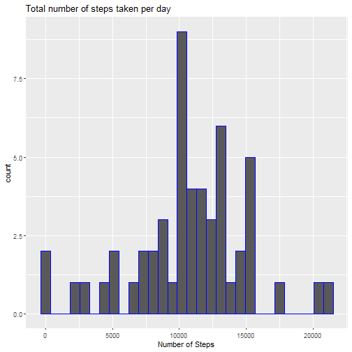
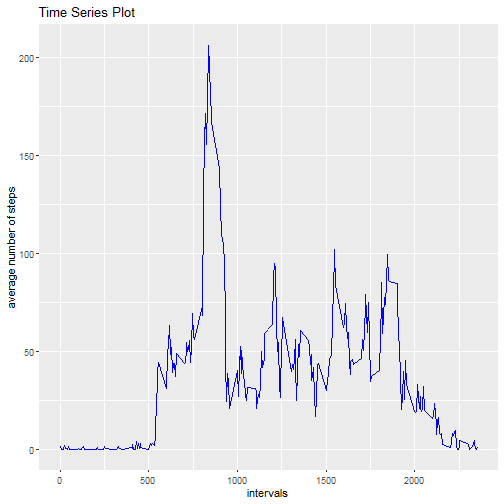
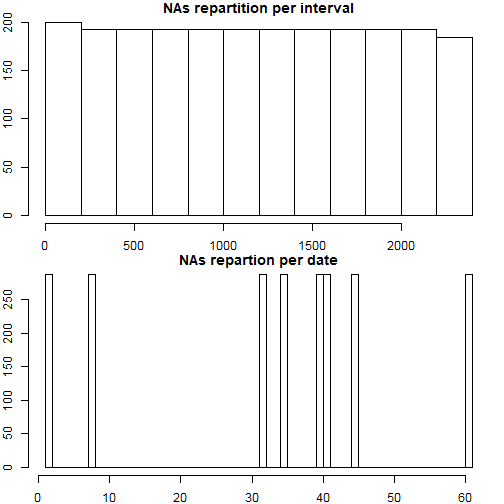
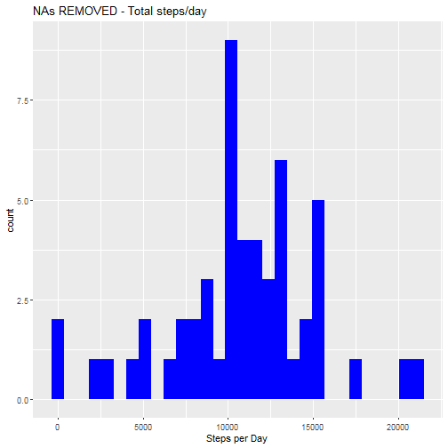
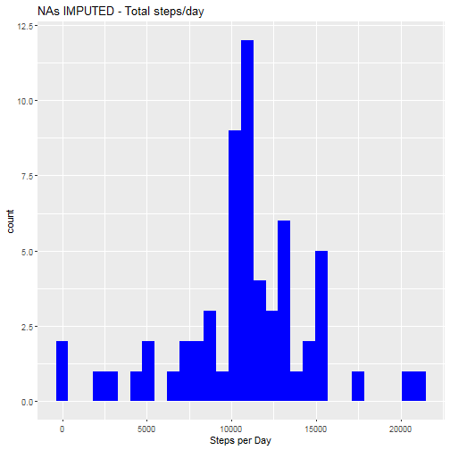
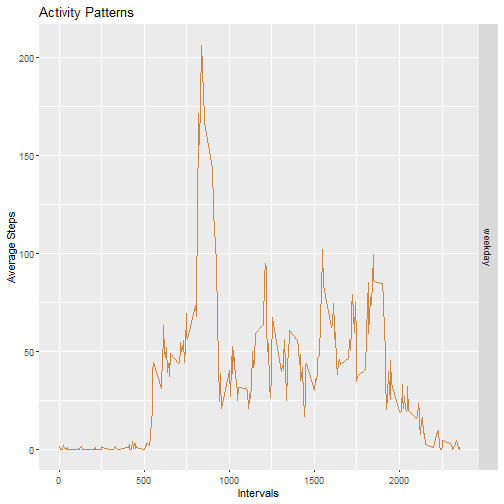

## Activity Monitoring

This is an R Markdown document. Markdown is a simple formatting syntax for authoring HTML, PDF, and MS Word documents. For more details on using R Markdown see <http://rmarkdown.rstudio.com>.

Lets start with reading the activity file:


```r
#remove all objects
rm(list=ls())
#set working directory: we skip this step and let the reader set their own working directory. 

#we check if the source file is loaded onto the wd of the reader, if not, we download it and unzip the file:
#if(!file.exists("activity.csv")) {
 #       tempfile <- tempfile()
  #      download.file("http://d396qusza40orc.cloudfront.net/repdata%2Fdata%2Factivity.zip",destfile = tempfile)
   #     unzip(tempfile)
    #    unlink(tempfile)
#}

df_act <- read.csv("activity.csv", header = TRUE)

summary(df_act)
```

```
##      steps                date          interval     
##  Min.   :  0.00   2012-10-01:  288   Min.   :   0.0  
##  1st Qu.:  0.00   2012-10-02:  288   1st Qu.: 588.8  
##  Median :  0.00   2012-10-03:  288   Median :1177.5  
##  Mean   : 37.38   2012-10-04:  288   Mean   :1177.5  
##  3rd Qu.: 12.00   2012-10-05:  288   3rd Qu.:1766.2  
##  Max.   :806.00   2012-10-06:  288   Max.   :2355.0  
##  NA's   :2304     (Other)   :15840
```

We could see that there are many observations with steps missing. Lets ignore the records with missing steps and carry on with our analysis:

## Total number of Steps taken per day


```r
activity_steps_day <- aggregate(steps ~ date, data = df_act, FUN = sum, na.rm = TRUE)

library(ggplot2)

ggplot(activity_steps_day, aes(x = steps)) + 
  geom_histogram(color = "blue") + labs(x = "Number of Steps", title = "Total number of steps taken per day")
```

```
## `stat_bin()` using `bins = 30`. Pick better value with `binwidth`.
```



### Mean and Median of the total number of steps taken per day


```r
mean_steps <- format(mean(activity_steps_day$steps), digits = 1)
median_steps <- format(median(activity_steps_day$steps), digits = 1)
```

Mean steps per day **10766**  
Median steps per day **10765**

## Average Daily activity pattern


```r
activity_steps_mean <- aggregate(steps ~ interval, data = df_act, FUN = mean, na.rm = TRUE)

ggplot(activity_steps_mean, aes(x = interval, y = steps)) + geom_line(color = "blue") + labs(x = "intervals", y = "average number of steps", title = "Time Series Plot")
```




Lets find out Which 5-minute interval, on average across all the days in the dataset, contains the maximum number of steps:


```r
#what is the highest steps value? (maximum of steps on one given interval)
max_steps <-max(activity_steps_mean$steps)
#for which interval are the numbers of steps per interval at the highest?
max_interval <- activity_steps_mean$interval[which(activity_steps_mean$steps == max_steps)]
max_steps <- round(max_steps, digits = 2)
```

The highest number of steps for a 5 minutes interval is **206.17**,  
which corresponds to interval **835**


## Imputing missing values

Lets calculate the number of missing values in main dataset


```r
n <- sum(is.na(df_act))
```

Number of missing obervations are **2304**

## Devise a strategy for filling in all of the missing values in the dataset

We run a couple of unsophisticated charts to decide which unsophisticated strategy we’ll adopt


```r
#subset general dataset with missing values only
missing_values <- subset(df_act, is.na(steps))
#plot repartition, by date or by intervals
par(mfrow = c(2,1), mar = c(2, 2, 1, 1))
hist(missing_values$interval, main="NAs repartition per interval")
hist(as.numeric(missing_values$date), main = "NAs repartion per date", breaks = 61)
```




## Create new dataset with the missing data filled in

We’ll follow these steps to replace the missing data:
- calculate average steps per interval, across all the days
- cut the ‘activity’ dataset in two parts: activity_NAs, activity_non_NAs
- in ‘activity_NAs’, we convert, we convert the ‘steps’ variable into a factor, then replace levels with new computed values
- a bit of formatting to convert the ‘steps’ vector variable into an integer vector
- merge/rbind the two datasets into a new dataset, with missing data filled in


```r
# calculate mean of steps per interval, we end up with a mean for all 288 intervals
MeanStepsPerInterval <- tapply(df_act$steps, df_act$interval, mean, na.rm = TRUE)
# cut the 'activity' dataset in 2 parts (with and without NAs)
activity_NAs <- df_act[is.na(df_act$steps),]
activity_non_NAs <- df_act[!is.na(df_act$steps),]
#replace missing values in activity_NAs
activity_NAs$steps <- as.factor(activity_NAs$interval)
levels(activity_NAs$steps) <- MeanStepsPerInterval
#change the vector back as integer 
levels(activity_NAs$steps) <- round(as.numeric(levels(activity_NAs$steps)))
activity_NAs$steps <- as.integer(as.vector(activity_NAs$steps))
#merge/rbind the two datasets together
imputed_activity <- rbind(activity_NAs, activity_non_NAs)
```

## Make a histogram of the total number of steps taken each day


```r
#Plotting parameters to place previous histogram and new one next to each other
par(mfrow = c(1,2))

#Plot again the histogram from the first part of the assignment
activity_steps_day <- aggregate(steps ~ date, data = df_act, FUN = sum, na.rm = TRUE)

ggplot(activity_steps_day, aes(x = steps)) + geom_histogram(fill = "blue") + labs(x = "Steps per Day", title = "NAs REMOVED - Total steps/day")
```

```
## `stat_bin()` using `bins = 30`. Pick better value with `binwidth`.
```



```r
#Plot new histogram, with imputed missing values
imp_activity_steps_day <- aggregate(steps ~ date, data = imputed_activity, FUN = sum, na.rm = TRUE)

ggplot(imp_activity_steps_day, aes(x = steps)) + geom_histogram(fill = "blue") + labs(x = "Steps per Day", title = "NAs IMPUTED - Total steps/day")
```

```
## `stat_bin()` using `bins = 30`. Pick better value with `binwidth`.
```



We calculate like previously the mean and median values, and store the new and old results in a data frame for easier comparison:


```r
imp_mean_steps <- mean(imp_activity_steps_day$steps)
imp_median_steps <- median(imp_activity_steps_day$steps)
#we set a normal number format to display the results
imp_mean_steps <- format(imp_mean_steps,digits=1)
imp_median_steps <- format(imp_median_steps,digits=1)
#store the results in a dataframe
results_mean_median <- data.frame(c(mean_steps, median_steps), c(imp_mean_steps, imp_median_steps))
colnames(results_mean_median) <- c("NA removed", "Imputed NA values")
rownames(results_mean_median) <- c("mean", "median")
```

We use the xtable package to print the table with all values:


```r
library(xtable)

xt <- xtable(results_mean_median)
print(xt)
```

```
## % latex table generated in R 3.6.0 by xtable 1.8-4 package
## % Wed Jul 17 23:14:15 2019
## \begin{table}[ht]
## \centering
## \begin{tabular}{rll}
##   \hline
##  & NA removed & Imputed NA values \\ 
##   \hline
## mean & 10766 & 10766 \\ 
##   median & 10765 & 10762 \\ 
##    \hline
## \end{tabular}
## \end{table}
```

## CONCLUSIONS:

Imputing missing values didn’t change the mean value whatsoever, the median value is reduced only by (3/10765*100), which is as good as nothing.
Both histograms show the same structure, with imputed NAs we notice however higher frequencies.


## Are there differences in activity patterns between weekdays and weekends?


```r
#elseif function to categorize Saturday and Sunday as factor level "weekend", all the rest as "weekday"
imputed_activity$dayType <- ifelse(weekdays(as.Date(imputed_activity$date)) == "Samstag" | weekdays(as.Date(imputed_activity$date)) == "Sonntag", "weekend", "weekday")
#transform dayType variable into factor
imputed_activity$dayType <- factor(imputed_activity$dayType)
```

## Panel plot containing time series plot


```r
#Aggregate a table showing mean steps for all intervals, acrlss week days and weekend days
steps_interval_dayType <- aggregate(steps ~ interval + dayType, data = imputed_activity, FUN = mean)
#verify new dataframe 
head(steps_interval_dayType)
```

```
##   interval dayType      steps
## 1        0 weekday 1.75409836
## 2        5 weekday 0.29508197
## 3       10 weekday 0.11475410
## 4       15 weekday 0.13114754
## 5       20 weekday 0.06557377
## 6       25 weekday 2.08196721
```

```r
#add descriptive variables
names(steps_interval_dayType) <- c("interval", "day_type", "mean_steps")
#plot with ggplot2
library(ggplot2)
plot <- ggplot(steps_interval_dayType, aes(interval, mean_steps))
plot + geom_line(color = "tan3") + facet_grid(day_type~.) + labs(x = "Intervals", y = "Average Steps", title = "Activity Patterns")
```




## CONCLUSION: 
it seems the tested subjects have an earlier start in the week days with a peak between 8am and 9am. On weekends, the activity seems more spread between 8am and 8pm.
